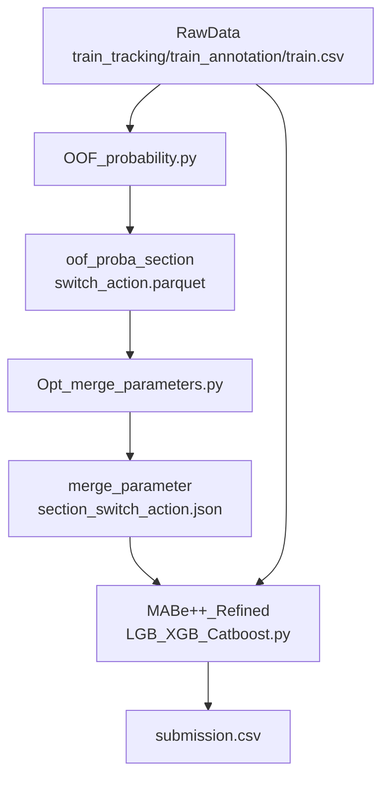

# Award-winning solution for the MABe Challenge - Social Action Recognition in Mice

本项目是对 Kaggle 竞赛 **MABe Mouse Behavior Detection** 的一套可复现解决方案的精简核心版：保留效果最好的特征工程与 **LGBM + XGB + CatBoost** 集成策略，并通过 **OOF 概率 + TPE** 自动寻优每个动作的融合权重与分类阈值，最终在全量数据上训练并生成 `submission.csv`。

- 竞赛链接：[MABe Mouse Behavior Detection](https://www.kaggle.com/competitions/mabe-mouse-behavior-detection)

---

## 项目结构

本目录下核心脚本仅 3 个：

- `OOF probability.py`
  - **用途**：按 `section(body_parts_tracked)`、`single/pair`、`action` 分别训练二分类模型，做 **5 折 StratifiedGroupKFold（按 video_id 分组）** 得到每个基模型的 OOF 概率。
  - **输出**：`oof_proba/{section}/{single|pair}/{action}.parquet`

- `Opt merge parameters.py`
  - **用途**：读取 OOF 概率，用 **Optuna + TPE** 搜索每个动作的 **最优融合权重** 与 **最优二分类阈值**。
  - **输出**：`merge_parameter/{section}/{single|pair}/{action}.json`

- `MABe++ Refined LGB+XGB+Catboost.py`
  - **用途**：使用与 OOF 一致的模型配置在全量数据上训练；推理时读取 `merge_parameter` 中每个动作的最优权重/阈值进行融合，并做时序平滑与事件级后处理，生成 `submission.csv`。

---

## 端到端流程（推荐：Kaggle Notebook）

三步顺序固定：

### 1) 生成 OOF 概率

运行 `OOF probability.py`：

- **输入**（脚本内固定为 Kaggle 输入路径）：
  - `/kaggle/input/MABe-mouse-behavior-detection/train.csv`
  - `/kaggle/input/MABe-mouse-behavior-detection/test.csv`
  - `/kaggle/input/MABe-mouse-behavior-detection/train_tracking/*/*.parquet`
  - `/kaggle/input/MABe-mouse-behavior-detection/train_annotation/*/*.parquet`
- **输出**：
  - `oof_proba/{section}/{single|pair}/{action}.parquet`

建议把 `oof_proba/` **打包成 Kaggle Dataset**（例如命名为 `oof-proba-data`），供下一步挂载读取。

### 2) TPE 寻优融合权重与阈值

运行 `Opt merge parameters.py`：

- **输入**：`OOF_BASE_DIR` 指向某个 Kaggle Dataset 中的 `oof_proba` 目录（当前脚本默认）：
  - `OOF_BASE_DIR = "/kaggle/input/oof-proba-data/oof_proba"`
- **输出**：
  - `merge_parameter/{section}/{single|pair}/{action}.json`

同样建议把 `merge_parameter/` **打包成 Kaggle Dataset**（例如命名为 `opt-parameters`），供下一步挂载读取。

### 3) 全量训练 + 推理 + 生成提交文件

运行 `MABe++ Refined LGB+XGB+Catboost.py`：

- **输入**：
  - MABe 原始数据：同第 1 步
  - 寻优结果：脚本默认从 Kaggle Dataset 读取
    - `MERGE_PARAM_DIR = "/kaggle/input/opt-parameters/merge_parameter"`
- **输出**：
  - `submission.csv`

---

## 数据与任务定义（简述）

### 数据形态

- 每个视频对应一段时间序列轨迹（`train_tracking/*.parquet`），包含多只鼠的多个身体关键点坐标（x/y）。
- `train.csv` 提供视频级元信息（例如 `video_id`, `frames_per_second`, `pix_per_cm_approx`, `body_parts_tracked` 等）以及该视频有哪些行为标签可用（`behaviors_labeled`）。
- `train_annotation/*.parquet` 提供带行为的事件区间（start/stop frame），脚本会把它展开成逐帧的 0/1 标签序列。

### 预测目标（提交格式）

最终提交是事件区间级别：`video_id, agent_id, target_id, action, start_frame, stop_frame`。  
脚本在推理阶段先产生逐帧动作概率，再通过阈值与后处理切分成事件区间。

---

## 方案核心：按动作二分类 + OOF + 自动寻优

整体是一个“先用 OOF 做融合/阈值校准，再全量训练推理”的流水线：

### 0) 任务拆解：section / single|pair / action

三份脚本都遵循同一拆解粒度：

- **section**：`train.body_parts_tracked` 的不同取值（脚本里用 `body_parts_tracked_list` 枚举，并按索引循环）。每个 section 表示“该视频轨迹里包含哪些 body parts”。  
  - 当 body parts 太多时，会过滤 `drop_body_parts`（头部装置、spine、tail 中间点等）。
- **switch**：`single`（单鼠自行为） vs `pair`（两鼠交互行为）。
- **action**：每个具体动作（例如 `rear` 等）。本方案把每个 action 当作一个**独立的二分类任务**训练与校准。

### 1) 样本生成与标签构造（按 video_id、按 agent/target）

`OOF probability.py` 与 `MABe++ Refined LGB+XGB+Catboost.py` 都通过 `generate_mouse_data(...)` 把一个视频展开成多个训练样本（时间序列帧级样本）：

- **轨迹读取**：从 `{train|test}_tracking/{lab_id}/{video_id}.parquet` 读取关键点坐标，并 pivot 成以 `video_frame` 为索引、以 `(mouse_id, bodypart, coord[x|y])` 为列的表。
- **单位归一**：用 `pix_per_cm_approx` 做尺度归一（把像素换算成近似厘米尺度），使不同视频可比。
- **single 样本**：
  - 仅保留 `target == 'self'` 的标注定义；
  - 对每个 `agent(mouse_id)` 生成一个样本：特征来自该鼠的轨迹；
  - 标签从 `train_annotation` 中取 `(agent_id==mouse_id, target_id==mouse_id)` 的区间，并展开成逐帧 0/1 序列；未标注处会是 `NaN`（后续会被 mask 掉）。
- **pair 样本**：
  - 仅保留 `target != 'self'` 的标注定义；
  - 对每个 `(agent, target)` **有序排列**生成样本（`itertools.permutations(..., 2)`），特征由两只鼠轨迹拼接（标记为 A/B）。
  - 标签从 `train_annotation` 中取 `(agent_id==agent, target_id==target)` 的区间并展开成逐帧 0/1。

> 关键点：后续所有训练、OOF、推理都是**帧级概率**，最终再切分为事件区间输出。

### 2) 特征工程（FPS-aware）

两种输入（single / pair）分别走 `transform_single(...)` 与 `transform_pair(...)`，特征大类包括：

- **几何距离/形态**：身体部位两两距离（平方距离）、elongation 等；
- **速度与活动度**：位移/速度统计，多窗口 rolling mean/std；
- **姿态/角度**：例如身体角度与变化；
- **跨尺度时序统计**：多尺度窗口（按 FPS 缩放）下的均值、方差、比值；
- **长程特征**：长窗口活动 burst、skip-gram 距离等；
- **交互特征（pair）**：两鼠相对距离、追逐/接近、速度相关、面对/朝向等；
- **数值健壮性**：`finalize_features` 会处理 `inf/-inf` 并尽量把特征降到 `float32` 以节省内存。

窗口长度会用 `_scale(frames_at_30fps, fps)` 按视频 FPS 进行缩放，避免“默认 30fps”带来的时序尺度错配。

### 3) 分层分组交叉验证（避免视频泄漏）

在 `OOF probability.py` 中，对每个 action（binary label）使用：

- **CV**：`StratifiedGroupKFold(n_splits=5, groups=video_id)`

这样可确保**同一个视频不会同时出现在训练折与验证折**，减少时间序列任务中最常见的数据泄漏（同源帧被打散到不同折）。

同时脚本做了基本跳过规则：

- **最少正样本**：`min_pos=5`（正样本太少直接返回全 0 OOF）
- **组数检查**：`unique(video_id) >= n_splits`
- **全 0 标签**：若该 action 在该数据块中全为 0，直接跳过/返回全 0

### 4) 基模型：2×LGBM + 1×XGB + 2×CatBoost（固定配置）

`build_base_models(...)`/`submit_ensemble(...)` 中定义了 5 个基模型（参数固定）：

- **LightGBM**（deep）
- **LightGBM**（very deep）
- **XGBoost**
- **CatBoost**（deep）
- **CatBoost**（very deep）

若环境无 xgboost、catboost 会自动跳过

GPU 自动检测与配置：

- **LightGBM**：`device_type='gpu'` 且 `gpu_use_dp=True`
- **XGBoost**：`tree_method='gpu_hist'`
- **CatBoost**：`task_type='GPU'`

没有 GPU 则使用 CPU 对应配置。

### 5) 大规模训练的采样与类不平衡处理（StratifiedSubsetClassifier）

由于帧级样本极多，本方案对每个基学习器在 `fit` 内执行：

- **分层子采样（stratified subsample）**：当样本量过大时仅取 `n_samples` 规模训练。脚本中：
  - single：`n_samples=2_000_000`
  - pair：`n_samples=900_000`
  - 且不同模型会再做比例缩放（例如 `n_samples/1.3`, `n_samples/2`, `n_samples/1.5` 等）。
- **多数类欠采样（undersampling）**：当二分类极度不平衡时，先把多数类下采样到不超过 `max_imbalance_ratio`（默认 `80.0`）。

实现上优先在“索引与 y 标签层面”完成采样，最后才把被选中的 `X` 子集转成 numpy，降低内存峰值。

### 6) OOF 概率输出（用于后续融合/阈值校准）

对每个 `section / single|pair / action` 生成一个 OOF parquet：

- **路径**：`oof_proba/{section}/{single|pair}/{action}.parquet`
- **列**：
  - `proba_model0 ... proba_model{k}`：每个基模型对正类的 OOF 概率（k 取决于环境中可用的模型数）
  - `label`：0/1 标签

### 7) TPE 寻优：融合权重 + 二分类阈值（按 action 独立寻优）

`Opt merge parameters.py` 读取上述 parquet，对每个 action 单独做一次 Optuna-TPE 优化：

- **试验次数**：`N_TRIALS = 500`
- **搜索空间**：
  - 权重：`w_i ~ Uniform(0, 1)`，随后归一化使 `sum(w)=1`
  - 阈值：`threshold ~ Uniform(0.0005, 0.49)`
- **目标函数**：最大化 `f1_score(y, (X @ w) >= threshold)`，并使用 `zero_division=0` 避免无正例预测时报错
- **单类回退**：若某个 parquet 的 `y` 只有一个类别，则使用简单回退权重/阈值并直接计算分数
- **输出**：`merge_parameter/{section}/{single|pair}/{action}.json`
  - `weights`（list[float]）
  - `threshold`（float）
  - `best_f1`（float）

### 8) 推理阶段：融合、平滑、多动作决策与事件输出

`MABe++ Refined LGB+XGB+Catboost.py` 推理阶段关键逻辑：

- **按 action 输出帧级概率**：
  - 对每个测试样本先计算 `X_te`
  - 对每个 action：5 个模型输出概率，堆叠为 `stacked`，再按 `merge_parameter` 中的 `weights` 得到融合概率 `pred[action]`
  - 若某 action 缺少寻优参数，则回退到默认权重（脚本中 `default_weights = [0.20, 0.15, 0.25, 0.22, 0.18]`，并按实际模型数截断再归一）

- **时序平滑（与寻优目标一致）**：
  - 在 `predict_multiclass_adaptive` 内对 `pred` 做 `rolling(window=12, min_periods=1, center=True).mean()`

- **从多动作概率到“每帧一个动作/other”**：
  - 对每帧取 `argmax` 得到候选动作；
  - 再对该候选动作应用动作阈值（单鼠/双鼠分别有阈值表），阈值会乘缩放因子：
    - `effective_threshold = threshold * THRESHOLD_SCALE`
  - 未通过阈值则判为 `other`（内部用 `-1` 标记）。

- **事件切分与过滤**：
  - 用“相邻帧动作是否变化”来切分区间；
  - 过滤持续时间过短的事件（脚本中 `duration >= 3`）。

- **robustify 约束修复**（最终保证提交合法）：
  - 清理非法行（`start_frame < stop_frame`、去 NaN）并转为 int；
  - 按 `(video_id, agent_id, target_id)` 分组，避免区间重叠；
  - 对未覆盖区间补 `other`（按 batch 拼接），保证整段视频时间线被覆盖。

---

## 目录与产物约定

- **OOF 概率**：`oof_proba/{section}/{single|pair}/{action}.parquet`
- **融合参数**：`merge_parameter/{section}/{single|pair}/{action}.json`
- **提交文件**：`submission.csv`

---

## 常见问题（FAQ）

### 1) 为什么要用 GroupKFold / StratifiedGroupKFold？

因为同一个 `video_id` 内帧与帧高度相关，如果随机打散，会造成训练集与验证集共享同一视频的片段，导致验证分数虚高、参数寻优失真。按 `video_id` 分组切分能显著降低泄漏风险。

### 2) `THRESHOLD_SCALE` 的作用与意义

- **评估机制的特点**：该竞赛的评估会基于“基准标签中声明为已标注的行为集合”进行计算（代码里对应 `behaviors_labeled`）。也就是说，某些实验室/视频可能只标注少数动作（例如只标注 `rear`），或只标注某些鼠对/鼠只；对于**未被声明/未被标注**的动作与鼠对组合，即使模型预测为正，也通常不会被计入假阳性惩罚（相当于被忽略）。这使得数据天然存在“其他动作发生但未标注”的漏标现象，从训练到测试都一致存在。
- **为什么要做阈值缩放**：在这种“部分标注/交集评估”的设定下，适当让预测更激进（降低阈值、提升召回）往往更划算：因为一部分额外预测落在未被评估的标签集合里不会扣分，而对被评估动作的召回提升反而能带来净增益。
- **具体做法**：用一个全局缩放因子把所有动作的阈值整体下调：  
  - `effective_threshold = threshold * THRESHOLD_SCALE`（当 `THRESHOLD_SCALE < 1` 时更激进）
- **经验效果**：即使已经对动作阈值做过寻优，再加 `THRESHOLD_SCALE` 仍可能带来约 `0.001 ~ 0.003` 的分数提升（属于经验性技巧，建议按验证/线上表现微调）。

### 3) 如何在本地运行？

当前脚本默认使用 Kaggle 的 `/kaggle/input/...` 路径。若本地运行，需要在代码里把这些路径改为你本地的数据目录。

---

## 依赖

脚本主要依赖：

- `pandas`, `numpy`, `scikit-learn`
- `lightgbm`
- `xgboost`
- `catboost`
- `optuna`（用于 TPE 寻优）
- `polars`（用于评分/后处理部分的数据操作）

